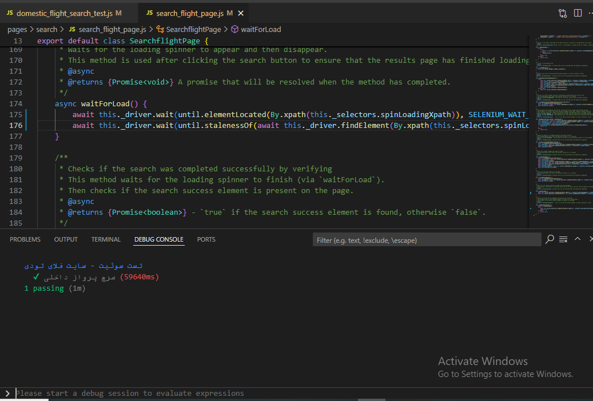

# ✈️ Flight Search UI Tests – FlyToday

This project contains automated UI tests for the FlyToday flight search website, written in JavaScript using Selenium WebDriver.

## ✅ Features

- Open FlyToday website and maximize the window
- Select domestic flights by default
- Handle any pop-ups
- Search flights from Tehran to Mashhad
- Select a date and perform the search
- Verify all UI interactions successfully

## 📸 Sample Test Result

Here is a screenshot of a successful test run using Selenium and JavaScript:




## ✅ How to run the tests (No GitHub or VS Code needed)

### 1. Requirements

- Node.js installed on your system  
  [Download from here](https://nodejs.org)

### 2. Download the project

- Download ZIP:  
  [https://github.com/Negin-Rezaei/flight-search-tests/archive/refs/heads/main.zip](https://github.com/Negin-Rezaei/flight-search-tests/archive/refs/heads/main.zip)
- Extract the ZIP file to your desktop or any folder

### 3. Install dependencies

Open a terminal (PowerShell or CMD) in the extracted folder and run:

```bash
npm install
